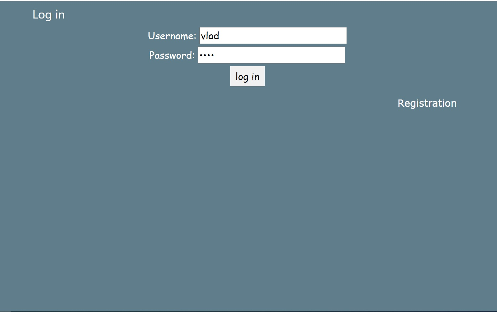
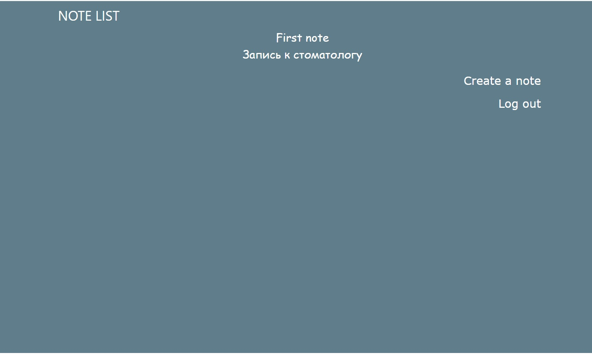
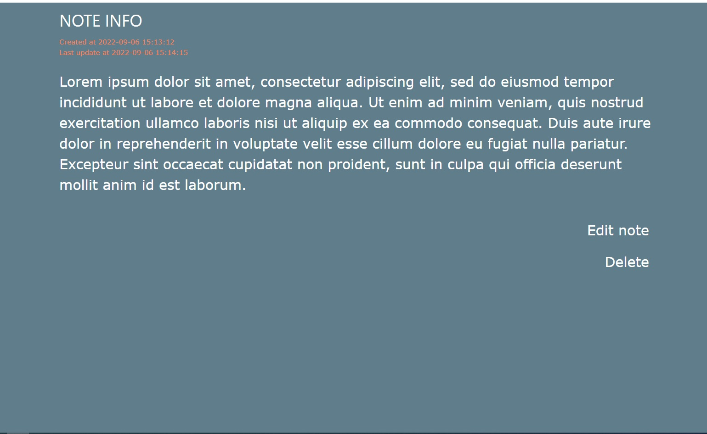

# Private Notes

-Приложение с функциональностью личного дневника; c аутентификацией и авторизацией пользователей (USER, ADMIN).

 

-Можно зарегистрироваться и создавать личные записи. Для каждой записи выводится дата создания и последнего обновления. 
Пароль пользователя хранится в БД в хешированном виде.

 

-Конфигурация: database PostgreSQL, JPA provider - Hibernate.

 
-Можно выдать пользователю роль ADMIN, тогда у него появится возможность перейти на страницу /admin, где видно всех зарегистрированных пользователей.
 
 

Скриншоты страниц: 

 

In order to run the application on your host, you need to create a file <i>hibernate.properties</i> in folder 
<i>/src/main/resources/</i> with data for connecting to your database (property file template - file <i>hibernate.properties.origin</i>
in the same directory)

